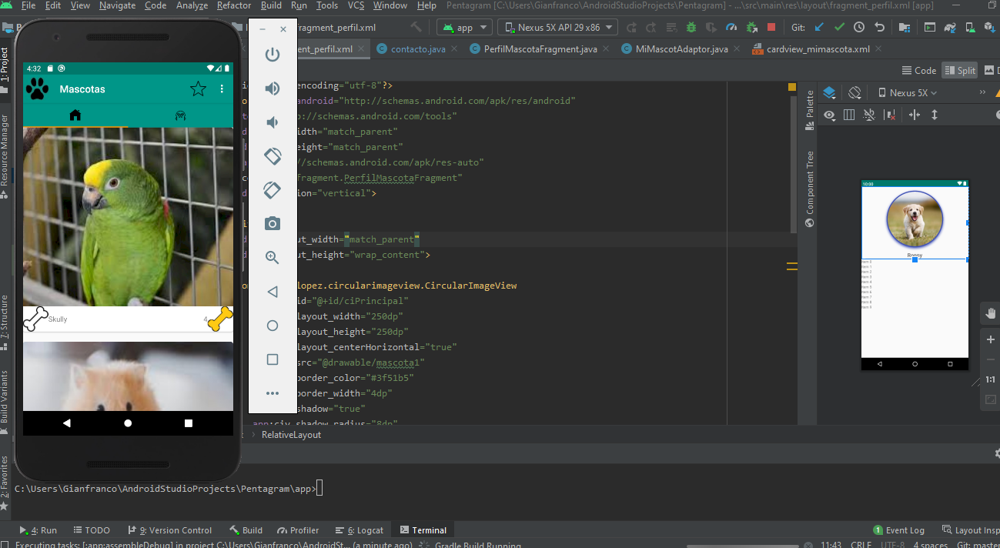
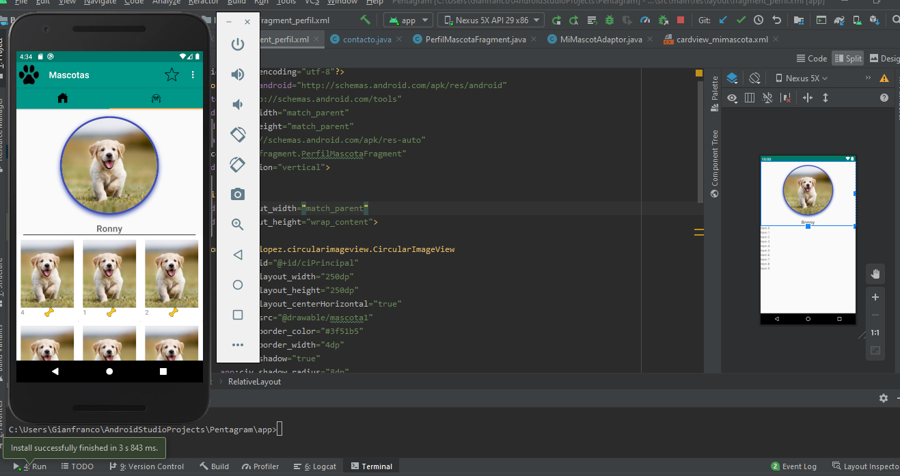
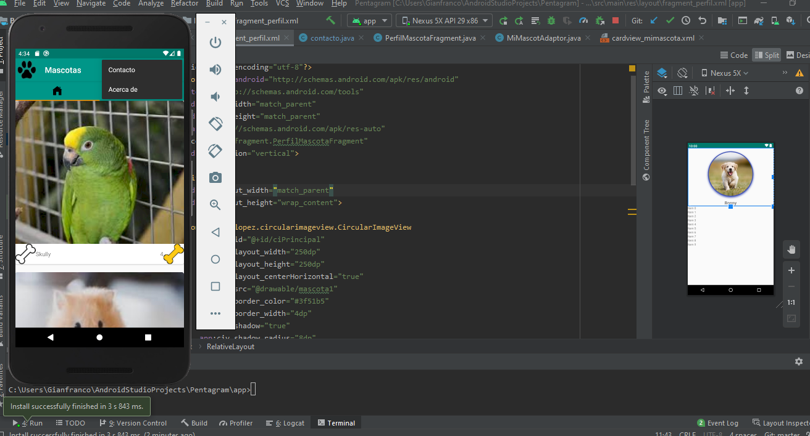
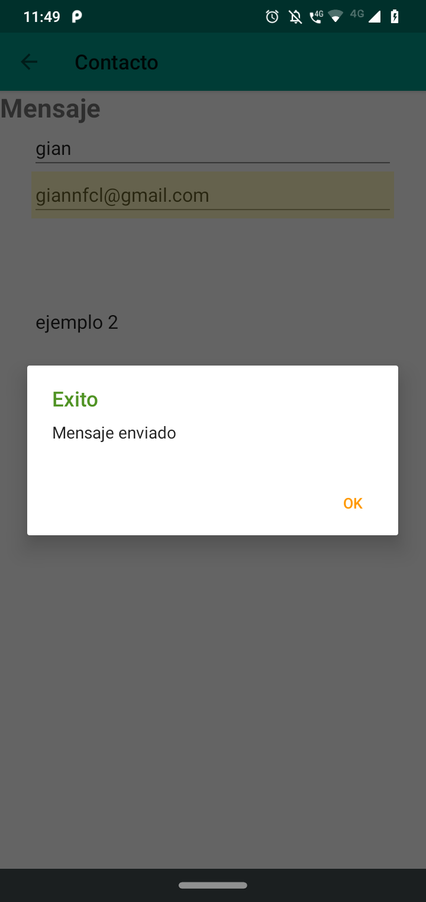
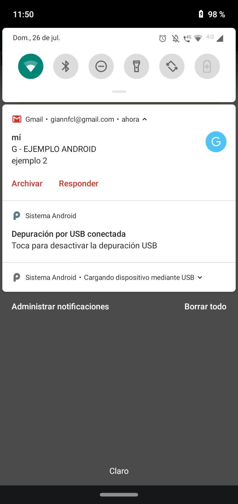
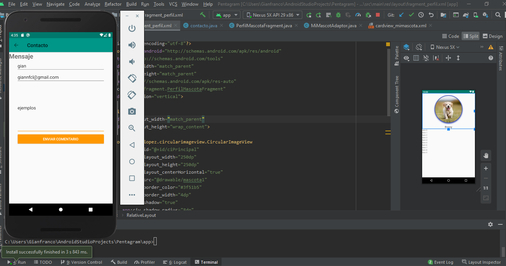
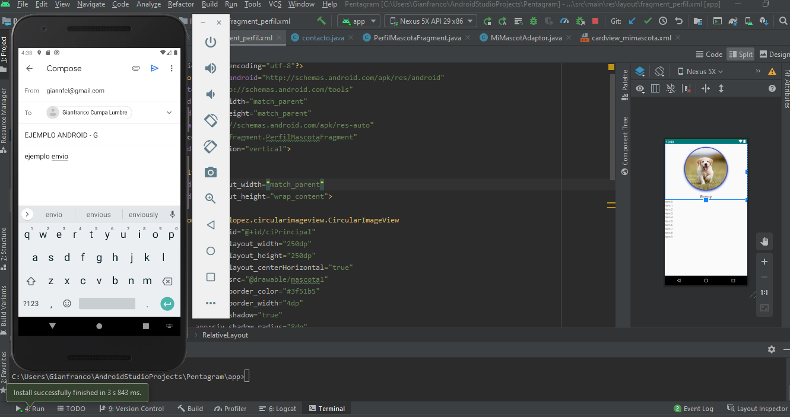

# pentagram_semana4
semana4
#Uso de Fragment,ViewPager,AppBar 
  

#Envio correo Forma 1 uso JavaMail (Requiere permiso de uso a terceros gmail )  
  

#Envio correo Forma 2 uso Intents Email  

 
