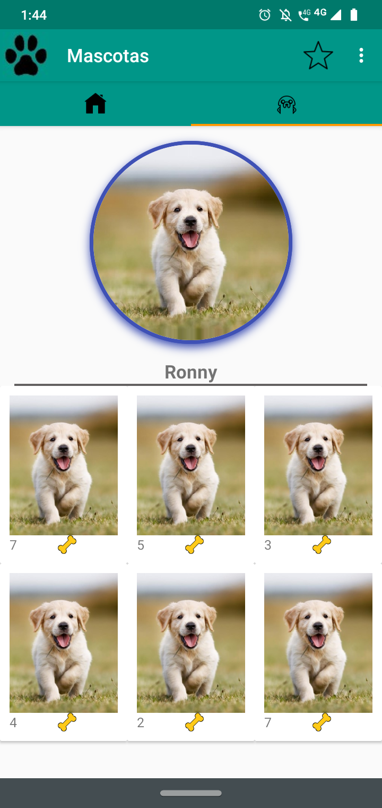

# pentagram_semana5
semana5
#Uso de MVP en todas las vistas de las mascotas (todas las mascotas, fotos de mis mascota por dia, fotos top del dia) 
#Uso de Interfaces para los adaptadores y ViewPager 
  
 
  
  
